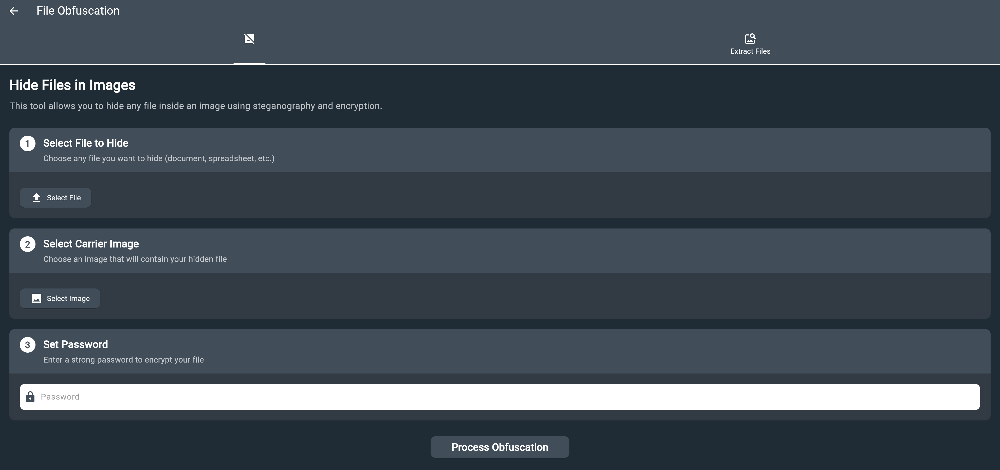

# File Obfuscator User Manual

## Table of Contents
1. [Overview](#overview)
2. [How It Works](#how-it-works)
3. [Features](#features)
4. [Usage Guide](#usage-guide)
5. [API Reference](#api-reference)
6. [Security Features](#security-features)
7. [Troubleshooting](#troubleshooting)
8. [Examples](#examples)
9. [Best Practices](#best-practices)

## Overview

File Obfuscation is a feature in iotsploit client that combines steganography and encryption to hide files within images. It provides a secure way to conceal sensitive documents, messages, or any digital content within seemingly innocent image files, effectively bypassing regulatory monitoring and content filtering systems.

**Location**: In iotsploit client, the File Obfuscation tool is available in the **Toolkit** section under the "File Obfuscation" card.

### What is Steganography?
Steganography is the practice of concealing information within other non-secret data or a physical object. In our case, we hide files within images in a way that is invisible to the human eye and difficult to detect without the proper tools.

### What is File Obfuscation?
File obfuscation involves making files unreadable or unrecognizable to unauthorized users while maintaining their original functionality for authorized users.

### Regulatory Bypass Benefits
By embedding files within images, this tool provides an effective method to bypass regulatory monitoring systems:
- **Content Filtering Evasion**: Image files are typically not subject to the same content scanning as document files
- **Network Monitoring Avoidance**: Image transfers often pass through monitoring systems without triggering alerts
- **Platform Restrictions Bypass**: Many platforms allow image sharing while restricting document uploads
- **Stealth Communication**: Enables secure file transmission that appears as normal image sharing

## How It Works

The File Obfuscator uses a multi-layered approach to securely hide files:

### 1. Encryption Layer
- **AES-256 Encryption**: Industry-standard encryption algorithm
- **Salt Generation**: Random 16-byte salt for each operation
- **IV (Initialization Vector)**: Random 16-byte IV for each encryption
- **Key Derivation**: PBKDF2-like key derivation using HMAC-SHA256

### 2. Compression Layer
- **ZIP Archive**: Compresses encrypted data for efficient storage
- **Metadata Storage**: Stores file information and encryption parameters
- **File Organization**: Structured archive with encrypted file and metadata

### 3. Steganography Layer
- **Image Carrier**: Uses your selected image as the carrier
- **Data Appending**: Appends the encrypted archive to the image data
- **Seamless Integration**: The image remains visually identical

 

## Features

### 🔒 **Advanced Security**
- AES-256 encryption with CBC mode
- Unique salt and IV for each operation
- Strong password-based key derivation
- Tamper-resistant metadata storage

### 🖼️ **Image Compatibility**
- Supports all common image formats
- Maintains original image quality
- No visible changes to the carrier image
- Efficient data embedding

### 📦 **Smart Compression**
- ZIP compression for optimal storage
- Metadata preservation
- Fast compression and decompression
- Cross-platform compatibility

### 🔑 **Password Protection**
- User-defined passwords
- Salt-based key derivation
- No password storage in the system
- Secure key generation

### 🚫 **Regulatory Bypass**
- Bypasses content filtering systems
- Evades network monitoring
- Overcomes platform restrictions
- Enables stealth file transmission

## Usage Guide

### How to Find the File Obfuscator Tool

The File Obfuscator tool is located in the **Toolkit** section of your Flutter application:

1. **Launch the Application**
   - Open your Flutter application
   - Look for the main navigation menu

2. **Navigate to Toolkit**
   - Find and click on the "Toolkit" menu item
   - This will take you to the toolkit overview page

3. **Locate File Obfuscation**
   - Look for the "File Obfuscation" card
   - It displays the description: "Hide files in images using steganography and encryption"
   - The card has a distinctive icon representing file obfuscation

4. **Access the Tool**
   - Click on the "File Obfuscation" card
   - This will open the File Obfuscator interface

### Prerequisites
- Flutter GUI application with the File Obfuscator tool
- Image file to use as carrier
- File to hide
- Strong password for encryption

### Step 1: Hiding a File

1. **Open the File Obfuscator Tool**
   - Launch your Flutter application
   - Navigate to the **Toolkit** section
   - Click on the "File Obfuscation" card
   - Select "Hide File" option from the tool interface

2. **Select Your Files**
   - Choose the file you want to hide
   - Select an image to use as the carrier
   - Enter a strong password for encryption

3. **Configure Settings**
   - Verify the file and image selections
   - Review the encryption settings
   - Confirm the output location

4. **Execute the Process**
   - Click "Hide File" button
   - Wait for the process to complete
   - Save the resulting obfuscated image

### Step 2: Extracting a File

1. **Open the Extraction Tool**
   - Navigate to the **Toolkit** section
   - Click on the "File Obfuscation" card
   - Select "Extract File" option from the tool interface

2. **Load the Obfuscated Image**
   - Choose the image containing hidden data
   - Enter the password used for encryption

3. **Extract the File**
   - Click "Extract File" button
   - Wait for the decryption process
   - Choose where to save the extracted file

4. **Verify the Result**
   - Check that the file was extracted correctly
   - Verify the original filename is preserved
   - Ensure file integrity is maintained

⚠️ **Important Warning**: If the obfuscated image was compressed or modified by chat applications (WeChat, WhatsApp, Telegram, etc.), file extraction may fail. Always use the original obfuscated image file for extraction.

## Tool Features

### File Hiding Function

The File Obfuscator tool provides a comprehensive file hiding capability:

**What it does:**
- Encrypts your selected file using AES-256 encryption
- Generates unique security parameters for each operation
- Compresses the encrypted data for efficient storage
- Embeds the data seamlessly within your chosen image
- Preserves the original image quality and appearance

**Input Requirements:**
- File to hide (any type and size)
- Carrier image (JPEG, PNG, GIF, etc.)
- Strong password for encryption
- Output location for the result

**Output:**
- An image file that looks identical to the original
- Contains your hidden file securely encrypted
- Ready for storage, sharing, or transmission

### File Extraction Function

The tool also provides secure file extraction:

**What it does:**
- Detects hidden data within obfuscated images
- Validates the image integrity
- Decrypts the hidden file using your password
- Restores the original file with its original name
- Maintains file integrity and metadata

**Input Requirements:**
- Image file containing hidden data
- Correct password used during encryption
- Destination folder for extracted file

**Output:**
- Original file restored exactly as it was
- Preserved filename and file structure
- Ready for normal use

**⚠️ Critical Requirement**: The image file must be exactly the same as when it was created. Any compression, resizing, or modification will prevent successful extraction.

## Security Features

### Encryption Details
 

- **Algorithm**: AES-256 in CBC mode
- **Key Size**: 256 bits (32 bytes)
- **Salt**: 16 random bytes per operation
- **IV**: 16 random bytes per encryption
- **Key Derivation**: HMAC-SHA256 with salt

### Security Benefits
- **Confidentiality**: Files are encrypted and unreadable without the password
- **Integrity**: Tampering with the image will corrupt the hidden data
- **Authentication**: Only users with the correct password can access files
- **Non-repudiation**: Each operation uses unique cryptographic parameters

### Threat Protection
- **Brute Force**: Strong encryption makes password guessing extremely difficult
- **Known Plaintext**: Salt and IV prevent pattern analysis
- **Side Channel**: No timing or memory leaks in the implementation
- **Data Recovery**: Corrupted images cannot be used to recover hidden files
- **Regulatory Detection**: Steganographic techniques make detection extremely difficult
- **Content Analysis**: Bypasses automated content scanning and filtering systems

## Troubleshooting

### Common Issues and Solutions

#### 1. "Failed to create ZIP archive"
**Cause**: Memory issues or corrupted input data
**Solution**: 
- Ensure sufficient memory is available
- Verify input file integrity
- Check file size limits

#### 2. "No hidden file found in the image"
**Cause**: Image doesn't contain hidden data or is corrupted
**Solution**:
- Verify the image contains hidden data
- Check if the image was modified after hiding
- Ensure the correct image file is being used

#### 3. "Metadata file not found in the hidden data"
**Cause**: Corrupted or incomplete hidden data
**Solution**:
- Verify the image wasn't truncated
- Check for file corruption
- Ensure the complete image is loaded

#### 4. "Error extracting file"
**Cause**: Incorrect password or corrupted data
**Solution**:
- Verify the password is correct
- Check for typos in the password
- Ensure the image wasn't modified

#### 5. "File extraction failed after chat transmission"
**Cause**: Image compression or modification by chat applications
**Solution**:
- Always use the original obfuscated image file
- Avoid sharing through chat apps that compress images
- Use direct file transfer methods (email, cloud storage, USB)
- Verify image file size hasn't changed after transmission

### Performance Tips
- Use appropriate image sizes for your hidden files
- Consider file compression before hiding
- Use strong, memorable passwords
- Keep backups of original files

## Usage Scenarios

### Scenario 1: Hiding Personal Documents

**Use Case**: You want to hide important personal documents like contracts, certificates, or financial statements within an innocent-looking photo.

**Process**:
1. Select your sensitive document file
2. Choose a family photo or vacation picture as the carrier
3. Set a strong, memorable password
4. Hide the file and save the result
5. Store the obfuscated image safely

**Benefits**: Your documents are now hidden in plain sight, appearing as just another photo in your collection.

### Scenario 2: Secure File Sharing

**Use Case**: You need to share confidential files with colleagues or clients through email or cloud storage.

**Process**:
1. Hide the confidential file in a professional image
2. Share the image file through your preferred channel
3. Provide the password separately via secure communication
4. Recipients use the tool to extract the hidden file

**Benefits**: Files can be shared through any channel without revealing their sensitive nature.

### Scenario 2.5: Regulatory Bypass Communication

**Use Case**: You need to transmit sensitive information in environments with strict content monitoring or restrictions.

**Process**:
1. Hide sensitive documents within ordinary images
2. Share images through standard communication channels
3. Bypass content filtering and monitoring systems
4. Maintain secure access through password protection

**Benefits**: Effective bypass of regulatory monitoring while maintaining security and confidentiality.

### Scenario 3: Backup and Archiving

**Use Case**: You want to create secure backups of important files that won't attract attention.

**Process**:
1. Hide multiple important files in a single image
2. Use a memorable image as the carrier
3. Store the obfuscated image in multiple locations
4. Access your files whenever needed with the password

**Benefits**: Secure backups that blend in with your regular photo collection.

### Scenario 4: Travel and Mobile Use

**Use Case**: You're traveling and want to carry important documents without physical copies.

**Process**:
1. Hide important documents in travel photos
2. Store the images on your phone or cloud
3. Access documents anywhere using the mobile app
4. No need to carry physical documents

**Benefits**: Digital document storage that's both secure and inconspicuous.

## Best Practices

### Security Best Practices
1. **Use Strong Passwords**
   - Minimum 12 characters
   - Mix of uppercase, lowercase, numbers, and symbols
   - Avoid common words or patterns
   - Use unique passwords for different purposes

2. **Choose Appropriate Carrier Images**
   - Use high-quality images
   - Avoid heavily compressed formats
   - Consider image size vs. hidden file size
   - Use images that won't attract suspicion

3. **File Management**
   - Keep original files as backups
   - Store passwords securely
   - Don't share obfuscated images publicly
   - Regularly update passwords

4. **Image Transmission Safety**
   - **Never share through chat apps** that compress images (WeChat, WhatsApp, Telegram)
   - Use direct file transfer methods (email, cloud storage, USB drives)
   - Verify file integrity after transmission
   - Keep the original obfuscated image for extraction

### Performance Best Practices
1. **File Size Optimization**
   - Consider file size before hiding (larger files take longer to process)
   - Use appropriate image formats (JPEG for photos, PNG for graphics)
   - Balance image quality vs. processing speed
   - Be patient with large files during processing

2. **Tool Usage**
   - Don't interrupt the process while it's running
   - Close other applications to free up system resources
   - Ensure stable internet connection if using cloud features
   - Keep the application updated for best performance

### Operational Best Practices
1. **Testing and Verification**
   - Start with small files to test the tool
   - Always verify extraction works before deleting original files
   - Test with different image formats to ensure compatibility
   - Practice password recovery to avoid data loss

2. **File Organization**
   - Keep a secure record of which images contain hidden files
   - Store passwords securely (not in the same location as the images)
   - Maintain a simple inventory of hidden files
   - Use descriptive names for obfuscated images

---

## Support and Contact

For technical support or questions about the File Obfuscator:

- **Documentation**: Refer to this manual
- **Code Examples**: Check the examples section
- **Troubleshooting**: Use the troubleshooting guide
- **Security**: Review security best practices

 