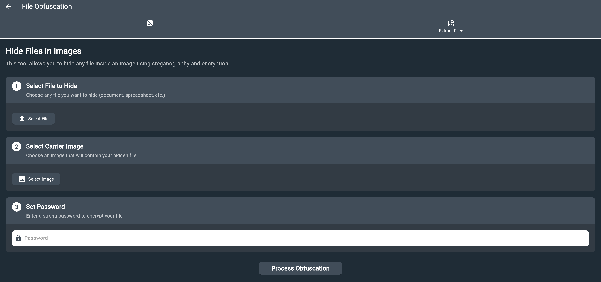

# 文件混淆器用户手册

## 目录
1. [概述](#概述)
2. [工作原理](#工作原理)
3. [功能特性](#功能特性)
4. [使用指南](#使用指南)
5. [API参考](#api参考)
6. [安全特性](#安全特性)
7. [故障排除](#故障排除)
8. [使用示例](#使用示例)
9. [最佳实践](#最佳实践)

## 概述

文件混淆是 **iotsploit client** 中的一个功能，它结合隐写术和加密技术在图像中隐藏文件，提供一种在看似无害的图像中安全隐藏敏感文档、消息或任何数字内容的方式，并可有效绕过监管监控与内容过滤系统。

**位置**：在 **iotsploit client** 中，文件混淆功能位于应用的 **Toolkit** 部分的「文件混淆」卡片下。

### 什么是隐写术？
隐写术是在其他非秘密数据或物理对象中隐藏信息的实践。在我们的案例中，我们以人眼无法察觉且没有适当工具难以检测的方式在图像中隐藏文件。

### 什么是文件混淆？
文件混淆涉及使文件对未授权用户不可读或不可识别，同时为授权用户保持其原始功能。

### 监管绕过优势
通过在图像中嵌入文件，该工具提供了绕过监管监控系统的有效方法：
- **内容过滤规避**：图像文件通常不受与文档文件相同的内容扫描
- **网络监控避免**：图像传输通常通过监控系统而不会触发警报
- **平台限制绕过**：许多平台允许图像共享但限制文档上传
- **隐蔽通信**：实现看起来像正常图像共享的安全文件传输

## 工作原理

文件混淆器使用多层方法来安全地隐藏文件：

### 1. 加密层
- **AES-256加密**：行业标准加密算法
- **盐值生成**：每次操作生成16字节随机盐值
- **IV（初始化向量）**：每次加密生成16字节随机IV
- **密钥派生**：使用HMAC-SHA256的类PBKDF2密钥派生

### 2. 压缩层
- **ZIP压缩**：压缩加密数据以实现高效存储
- **元数据存储**：存储文件信息和加密参数
- **文件组织**：包含加密文件和元数据的结构化压缩包

### 3. 隐写术层
- **图像载体**：使用您选择的图像作为载体
- **数据附加**：将加密压缩包附加到图像数据
- **无缝集成**：图像保持视觉上完全相同

 

## 功能特性

### 🔒 **高级安全性**
- 使用CBC模式的AES-256加密
- 每次操作使用唯一盐值和IV
- 基于密码的强大密钥派生
- 防篡改元数据存储

### 🖼️ **图像兼容性**
- 支持所有常见图像格式
- 保持原始图像质量
- 载体图像无可见变化
- 高效数据嵌入

### 📦 **智能压缩**
- ZIP压缩实现最佳存储
- 元数据保护
- 快速压缩和解压缩
- 跨平台兼容性

### 🔑 **密码保护**
- 用户定义密码
- 基于盐值的密钥派生
- 系统中不存储密码
- 安全密钥生成

### 🚫 **监管绕过**
- 绕过内容过滤系统
- 规避网络监控
- 克服平台限制
- 实现隐蔽文件传输

## 使用指南

### 如何找到文件混淆器工具

文件混淆器工具位于您的Flutter应用程序的 **Toolkit** 部分：

1. **启动应用程序**
   - 打开您的Flutter应用程序
   - 查找主导航菜单

2. **导航到 Toolkit**
   - 找到并点击 "Toolkit" 菜单项
   - 这将带您到工具概览页面

3. **定位文件混淆**
   - 查找"文件混淆"卡片
   - 它显示描述："使用隐写术和加密在图像中隐藏文件"
   - 该卡片有一个代表文件混淆的独特图标

4. **访问工具**
   - 点击"文件混淆"卡片
   - 这将打开文件混淆器界面

### 前提条件
- 具有文件混淆器工具的Flutter GUI应用程序
- 用作载体的图像文件
- 要隐藏的文件
- 用于加密的强密码

### 步骤1：隐藏文件

1. **打开文件混淆器工具**
   - 启动您的Flutter应用程序
   - 导航到 **Toolkit** 部分
   - 点击"文件混淆"卡片
   - 从工具界面选择"隐藏文件"选项

2. **选择您的文件**
   - 选择要隐藏的文件
   - 选择用作载体的图像
   - 输入用于加密的强密码

3. **配置设置**
   - 验证文件和图像选择
   - 检查加密设置
   - 确认输出位置

4. **执行过程**
   - 点击"隐藏文件"按钮
   - 等待过程完成
   - 保存生成的混淆图像

### 步骤2：提取文件

1. **打开提取工具**
   - 导航到 **Toolkit** 部分
   - 点击"文件混淆"卡片
   - 从工具界面选择"提取文件"选项

2. **加载混淆图像**
   - 选择包含隐藏数据的图像
   - 输入用于加密的密码

3. **提取文件**
   - 点击"提取文件"按钮
   - 等待解密过程
   - 选择保存提取文件的位置

4. **验证结果**
   - 检查文件是否正确提取
   - 验证原始文件名是否保留
   - 确保文件完整性得到维护

⚠️ **重要警告**：如果混淆后的图像被聊天应用程序（微信、WhatsApp、Telegram等）压缩或修改，文件提取可能会失败。始终使用原始的混淆图像文件进行提取。

## 工具功能

### 文件隐藏功能

文件混淆器工具提供全面的文件隐藏能力：

**功能说明：**
- 使用AES-256加密加密您选择的文件
- 为每次操作生成唯一的安全参数
- 压缩加密数据以实现高效存储
- 将数据无缝嵌入到您选择的图像中
- 保持原始图像质量和外观

**输入要求：**
- 要隐藏的文件（任何类型和大小）
- 载体图像（JPEG、PNG、GIF等）
- 用于加密的强密码
- 结果输出位置

**输出结果：**
- 看起来与原始图像完全相同的图像文件
- 包含您安全加密的隐藏文件
- 准备好存储、共享或传输

### 文件提取功能

该工具还提供安全的文件提取：

**功能说明：**
- 检测混淆图像中的隐藏数据
- 验证图像完整性
- 使用您的密码解密隐藏文件
- 恢复原始文件及其原始名称
- 维护文件完整性和元数据

**输入要求：**
- 包含隐藏数据的图像文件
- 加密期间使用的正确密码
- 提取文件的目标文件夹

**输出结果：**
- 完全按原样恢复的原始文件
- 保留的文件名和文件结构
- 准备好正常使用

**⚠️ 关键要求**：图像文件必须与创建时完全一致。任何压缩、调整大小或修改都将阻止成功提取。

## 安全特性

### 加密详情
 

- **算法**：CBC模式的AES-256
- **密钥大小**：256位（32字节）
- **盐值**：每次操作16字节随机盐值
- **IV**：每次加密16字节随机IV
- **密钥派生**：使用盐值的HMAC-SHA256

### 安全优势
- **机密性**：文件被加密，没有密码无法读取
- **完整性**：篡改图像将损坏隐藏数据
- **认证**：只有具有正确密码的用户才能访问文件
- **不可否认性**：每次操作使用唯一的加密参数

### 威胁防护
- **暴力破解**：强加密使密码猜测极其困难
- **已知明文**：盐值和IV防止模式分析
- **侧信道**：实现中无时间或内存泄漏
- **数据恢复**：损坏的图像无法用于恢复隐藏文件
- **监管检测**：隐写术技术使检测极其困难
- **内容分析**：绕过自动内容扫描和过滤系统

## 故障排除

### 常见问题和解决方案

#### 1. "创建ZIP压缩包失败"
**原因**：内存问题或损坏的输入数据
**解决方案**：
- 确保有足够的内存
- 验证输入文件完整性
- 检查文件大小限制

#### 2. "在图像中未找到隐藏文件"
**原因**：图像不包含隐藏数据或已损坏
**解决方案**：
- 验证图像包含隐藏数据
- 检查图像在隐藏后是否被修改
- 确保使用正确的图像文件

#### 3. "在隐藏数据中未找到元数据文件"
**原因**：损坏或不完整的隐藏数据
**解决方案**：
- 验证图像未被截断
- 检查文件损坏
- 确保完整加载图像

#### 4. "提取文件时出错"
**原因**：密码不正确或数据损坏
**解决方案**：
- 验证密码正确
- 检查密码中的拼写错误
- 确保图像未被修改

#### 5. "聊天传输后文件提取失败"
**原因**：聊天应用程序压缩或修改图像
**解决方案**：
- 始终使用原始的混淆图像文件
- 避免通过压缩图像的聊天应用共享
- 使用直接文件传输方法（电子邮件、云存储、USB）
- 验证传输后图像文件大小是否发生变化

### 性能提示
- 为隐藏文件使用适当的图像大小
- 考虑在隐藏前压缩文件
- 使用强、易记的密码
- 保留原始文件备份

## 使用场景

### 场景1：隐藏个人文档

**使用情况**：您想要在看似无害的照片中隐藏重要的个人文档，如合同、证书或财务报表。

**操作过程**：
1. 选择您的敏感文档文件
2. 选择家庭照片或度假照片作为载体
3. 设置强、易记的密码
4. 隐藏文件并保存结果
5. 安全存储混淆后的图像

**优势**：您的文档现在隐藏在显而易见的地方，看起来就像您收藏中的另一张照片。

### 场景2：安全文件共享

**使用情况**：您需要通过电子邮件或云存储与同事或客户共享机密文件。

**操作过程**：
1. 在专业图像中隐藏机密文件
2. 通过您首选的渠道共享图像文件
3. 通过安全通信单独提供密码
4. 接收者使用工具提取隐藏文件

**优势**：文件可以通过任何渠道共享，而不会暴露其敏感性质。

### 场景2.5：监管绕过通信

**使用情况**：您需要在具有严格内容监控或限制的环境中传输敏感信息。

**操作过程**：
1. 在普通图像中隐藏敏感文档
2. 通过标准通信渠道共享图像
3. 绕过内容过滤和监控系统
4. 通过密码保护维护安全访问

**优势**：有效绕过监管监控，同时保持安全性和机密性。

### 场景3：备份和归档

**使用情况**：您想要创建不会引起注意的重要文件安全备份。

**操作过程**：
1. 在单个图像中隐藏多个重要文件
2. 使用难忘的图像作为载体
3. 在多个位置存储混淆后的图像
4. 随时使用密码访问您的文件

**优势**：与您常规照片收藏融为一体的安全备份。

### 场景4：旅行和移动使用

**使用情况**：您正在旅行，想要携带重要文档而无需物理副本。

**操作过程**：
1. 在旅行照片中隐藏重要文档
2. 将图像存储在手机或云端
3. 使用移动应用程序在任何地方访问文档
4. 无需携带物理文档

**优势**：既安全又不引人注目的数字文档存储。

## 最佳实践

### 安全最佳实践
1. **使用强密码**
   - 最少12个字符
   - 混合大写、小写、数字和符号
   - 避免常见单词或模式
   - 为不同目的使用唯一密码

2. **选择合适的载体图像**
   - 使用高质量图像
   - 避免严重压缩的格式
   - 考虑图像大小与隐藏文件大小的关系
   - 使用不会引起怀疑的图像

3. **文件管理**
   - 保留原始文件作为备份
   - 安全存储密码
   - 不要公开分享混淆后的图像
   - 定期更新密码

4. **图像传输安全**
   - **切勿通过压缩图像的聊天应用共享**（微信、WhatsApp、Telegram等）
   - 使用直接文件传输方法（电子邮件、云存储、U盘）
   - 传输后验证文件完整性
   - 保留原始混淆图像用于提取

### 性能最佳实践
1. **文件大小优化**
   - 考虑隐藏前的文件大小（较大的文件处理时间更长）
   - 使用适当的图像格式（照片用JPEG，图形用PNG）
   - 平衡图像质量与处理速度
   - 处理大文件时要有耐心

2. **工具使用**
   - 在运行过程中不要中断进程
   - 关闭其他应用程序以释放系统资源
   - 如果使用云功能，确保网络连接稳定
   - 保持应用程序更新以获得最佳性能

### 操作最佳实践
1. **测试和验证**
   - 从小文件开始测试工具
   - 在删除原始文件前始终验证提取是否有效
   - 使用不同图像格式测试以确保兼容性
   - 练习密码恢复以避免数据丢失

2. **文件组织**
   - 安全记录哪些图像包含隐藏文件
   - 安全存储密码（不要与图像存储在同一位置）
   - 维护隐藏文件的简单清单
   - 为混淆后的图像使用描述性名称

---

## 支持和联系

对于文件混淆器的技术支持或问题：

- **文档**：参考本手册
- **代码示例**：查看示例部分
- **故障排除**：使用故障排除指南
- **安全**：审查安全最佳实践

 